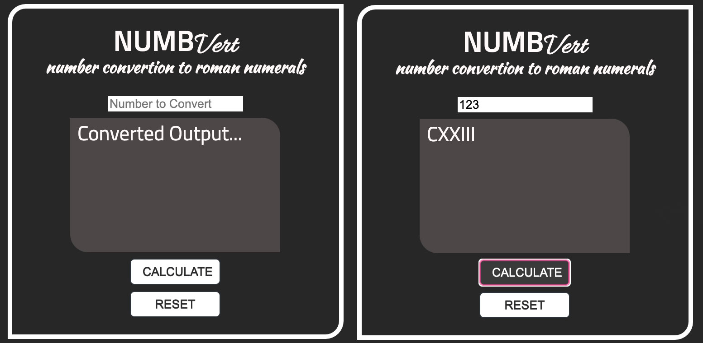

## [Coding 020]

create in react a roman numerals converter 

### Status:
 * able to convert - done
 * styled - 90%
 * complete - 100%
 * working - YES!

### challenge:
* -- implement redux
* -- only css no scss

## TEST
*INPUT:*
123

*OUTPUT:*
CXXIII

## Visuals

### Note:
* App.js - earlier version with no redux
* App_f.js - version which uses redux for status monitoring
